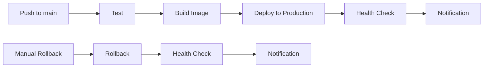

# 🚀 ShopSifu Backend Server

Backend server cho ứng dụng e-commerce ShopSifu, được xây dựng với NestJS và tối ưu hóa cho Docker Swarm.

## 🏗️ **Kiến trúc hệ thống**

- **Framework**: NestJS (Node.js)
- **Database**: PostgreSQL 16 với PgBouncer connection pooling
- **Cache**: Redis 7 với persistence
- **Search**: Elasticsearch 8.13.4
- **Monitoring**: Prometheus + Grafana
- **Logging**: Kibana
- **Deployment**: Docker Swarm

## 🚀 **Khởi chạy với Docker Swarm**

### 1. **Sử dụng script tự động (Khuyến nghị)**

```bash
# Deploy stack với script tự động
./scripts/deploy-swarm.sh

# Clean up Docker resources
./scripts/docker-cleanup.sh
```

### 2. **Thủ công**

```bash
# Kiểm tra Docker Swarm
docker info | grep -i swarm

# Khởi tạo Swarm (nếu chưa có)
docker swarm init

# Deploy stack
docker stack deploy -c docker-compose.swarm.yml shopsifu

# Kiểm tra trạng thái
docker service ls
```

## 🔧 **Quản lý Docker Swarm**

### **Xem trạng thái services**
```bash
docker service ls
docker service ps shopsifu_server
```

### **Scale services**
```bash
# Scale server lên 5 replicas
docker service scale shopsifu_server=5

# Scale xuống 2 replicas
docker service scale shopsifu_server=2
```

### **Update service**
```bash
# Update image
docker service update --image server-shopsifu:new-version shopsifu_server

# Update environment variables
docker service update --env-add NEW_VAR=value shopsifu_server
```

### **Rollback service**
```bash
docker service rollback shopsifu_server
```

### **Dừng và xóa stack**
```bash
# Dừng stack
docker stack rm shopsifu

# Clean up resources
./scripts/docker-cleanup.sh
```

## 🧹 **Docker Cleanup & Maintenance**

### **Scripts tự động**
- **`scripts/deploy-swarm.sh`**: Deploy stack với kiểm tra đầy đủ
- **`scripts/docker-cleanup.sh`**: Clean up toàn bộ Docker resources
- **`scripts/backup-manual.sh`**: Backup manual trực tiếp trên server
- **`scripts/restore-backup.sh`**: Restore từ backup với interactive mode
- **`scripts/backup-status.sh`**: Kiểm tra trạng thái backup và disk usage

### **Clean up thủ công**
```bash
# Remove stack
docker stack rm shopsifu

# Clean up containers
docker container prune -f

# Clean up networks
docker network prune -f

# Clean up volumes
docker volume prune -f

# Clean up images
docker image prune -f

# Full system cleanup
docker system prune -f
```

### **Kiểm tra resources**
```bash
# Xem disk usage
docker system df

# Xem build cache
docker builder df

# Xem volumes
docker volume ls
```

## 📊 **Monitoring & Logging**

### **Prometheus**
- **Port**: 9090
- **Metrics**: Application, PostgreSQL, Redis, Elasticsearch
- **Retention**: 30 ngày

### **Grafana**
- **Port**: 3001
- **Admin**: admin/Shopsifu2025
- **Dashboards**: Pre-configured cho ShopSifu

### **Kibana**
- **Port**: 5601
- **Features**: Log analysis, search, visualization

## 🗄️ **Database & Cache**

### **PostgreSQL**
- **Port**: 5432
- **Connection Pool**: PgBouncer (port 6432)
- **Max Connections**: 2000
- **Optimized**: 30 cores, 25GB RAM

### **Redis**
- **Port**: 6379
- **Memory**: 20GB
- **Persistence**: AOF + RDB
- **Policy**: noeviction

### **Elasticsearch**
- **Port**: 9200
- **Memory**: 16GB heap
- **Security**: Disabled (development)
- **Discovery**: Single node

## 🗄️ **Backup & Recovery**

### **Automated Backup**
- **Schedule**: Chạy mỗi ngày lúc 2:00 AM
- **Location**: `/backup/shopsifu/`
- **Retention**: 3 ngày (có thể tùy chỉnh)
- **Types**: Database, Files, Configuration, Docker Volumes

### **Manual Backup**
```bash
# Backup trực tiếp trên server
./scripts/backup-manual.sh

# Backup với GitHub Actions
# Actions > System Backup > Run workflow
```

### **Backup Status Check**
```bash
# Kiểm tra trạng thái backup
./scripts/backup-status.sh
```

### **Restore from Backup**
```bash
# Interactive restore mode
./scripts/restore-backup.sh

# Command line restore
./scripts/restore-backup.sh --list                    # Liệt kê backups
./scripts/restore-backup.sh --details 20241201_143022 # Chi tiết backup
./scripts/restore-backup.sh --full-restore 20241201_143022 # Restore toàn bộ
```

### **Backup Contents**
- **Database**: PostgreSQL dump với format custom
- **Files**: Application source code (exclude node_modules, .git)
- **Config**: Configuration files, Docker files, scripts
- **Volumes**: Docker data volumes (PostgreSQL, Redis, Elasticsearch)
- **Manifest**: Backup metadata và thông tin

## 🔒 **Security**

### **Production Checklist**
- [ ] Enable Elasticsearch security
- [ ] Set strong passwords
- [ ] Configure SSL/TLS
- [ ] Restrict network access
- [ ] Enable authentication cho monitoring
- [ ] Configure backup encryption
- [ ] Test backup restore procedures

### **Development Setup**
- Security disabled cho dễ test
- Passwords mặc định: `Shopsifu2025`
- Network: Docker internal only

## 📁 **Cấu trúc thư mục**

```
.
├── config/                 # Cấu hình services
│   ├── elasticsearch.yml   # Elasticsearch config
│   ├── postgresql.conf     # PostgreSQL config
│   ├── redis.conf         # Redis config
│   ├── pgbouncer.ini      # PgBouncer config
│   ├── grafana.ini        # Grafana config
│   └── kibana.yml         # Kibana config
├── monitoring/             # Monitoring configs
│   ├── prometheus/         # Prometheus config
│   └── grafana/            # Grafana config
├── scripts/                # Automation scripts
│   ├── deploy-swarm.sh     # Deploy script
│   ├── docker-cleanup.sh   # Cleanup script
│   ├── backup-manual.sh    # Manual backup script
│   ├── restore-backup.sh   # Restore backup script
│   └── backup-status.sh    # Backup status check script
├── logs/                   # Application logs
├── certs/                  # SSL certificates
├── upload/                 # User uploads
├── docker-compose.swarm.yml # Docker Swarm compose
├── .env.docker             # Docker environment
└── README.md               # This file
```

## 🚨 **Troubleshooting**

### **Service không khởi động**
```bash
# Kiểm tra logs
docker service logs shopsifu_server

# Kiểm tra trạng thái
docker service ps shopsifu_server

# Restart service
docker service update --force shopsifu_server
```

### **Database connection issues**
```bash
# Kiểm tra PostgreSQL
docker service logs shopsifu_postgres

# Kiểm tra PgBouncer
docker service logs shopsifu_pgbouncer

# Test connection
docker exec -it $(docker ps -q -f name=postgres) pg_isready -U shopsifu
```

### **Elasticsearch issues**
```bash
# Kiểm tra logs
docker service logs shopsifu_elasticsearch

# Kiểm tra health
curl http://localhost:9200/_cluster/health

# Reset password (nếu cần)
docker exec -it $(docker ps -q -f name=elasticsearch) /usr/share/elasticsearch/bin/elasticsearch-reset-password -u elastic -i
```

### **Docker cleanup issues**
```bash
# Force remove stack
docker stack rm --force shopsifu

# Force remove services
docker service rm --force $(docker service ls -q)

# Force remove containers
docker rm -f $(docker ps -aq)

# Full system reset
docker system prune -a -f --volumes
```

## 📈 **Performance Tuning**

### **Server Optimization**
- **Workers**: 3 replicas (6 cores, 12GB RAM mỗi replica)
- **Thread Pool**: 40 threads per replica
- **Memory**: 12GB heap per replica
- **Concurrency**: 3000 requests per replica

### **Database Optimization**
- **Connection Pool**: 20-100 connections
- **Shared Buffers**: 8GB
- **Effective Cache**: 20GB
- **Work Memory**: 32MB

### **Cache Optimization**
- **Memory**: 20GB
- **IO Threads**: 8
- **Persistence**: AOF + RDB
- **Eviction**: noeviction

## 🚀 **CI/CD Pipeline**

### **Workflows**

#### **🧪 Test Application** (`test.yml`)
- **Trigger**: Push/PR to main, master, develop
- **Jobs**: Test, Lint, Type Check
- **Purpose**: Đảm bảo code quality trước khi merge

#### **🏗️ Build Docker Image** (`build.yml`)
- **Trigger**: Push/PR to main, master
- **Jobs**: Security Scan, Build & Push
- **Output**: Docker image trên GHCR

#### **🚀 Deploy to Production** (`deploy-production.yml`)
- **Trigger**: Build workflow thành công
- **Jobs**: Deploy, Health Check, Notification
- **Purpose**: Tự động deploy lên production

#### **🔄 Rollback Production** (`rollback.yml`)
- **Trigger**: Manual trigger
- **Jobs**: Rollback, Health Check, Notification
- **Purpose**: Khôi phục về version trước khi có vấn đề

#### **📊 System Status Check** (`status.yml`)
- **Trigger**: Scheduled (mỗi 6 giờ) + Manual
- **Jobs**: Status Check, Notification
- **Purpose**: Kiểm tra trạng thái hệ thống định kỳ

#### **🗄️ System Backup** (`backup.yml`)
- **Trigger**: Scheduled (mỗi ngày lúc 2:00 AM) + Manual
- **Jobs**: Backup, Notification
- **Purpose**: Backup toàn bộ hệ thống tự động

### **Quy trình hoạt động**



### **Manual Actions**

#### **Deploy specific image**
```bash
# Trigger deploy workflow với image tag cụ thể
# Actions > Deploy to Production > Run workflow > image_tag: v1.2.3
```

#### **Rollback**
```bash
# Actions > Rollback Production > Run workflow
# Input: commit_sha (optional), reason
```

## 🤝 **Contributing**

1. Fork repository
2. Tạo feature branch
3. Commit changes
4. Push to branch
5. Tạo Pull Request

## 📄 **License**

MIT License - xem file [LICENSE](LICENSE) để biết thêm chi tiết.

## 📞 **Support**

- **Email**: shopsifu.ecommerce@gmail.com
- **Issues**: GitHub Issues
- **Documentation**: Wiki

---

**Made with ❤️ by ShopSifu Team**
